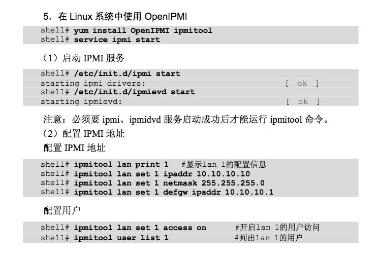
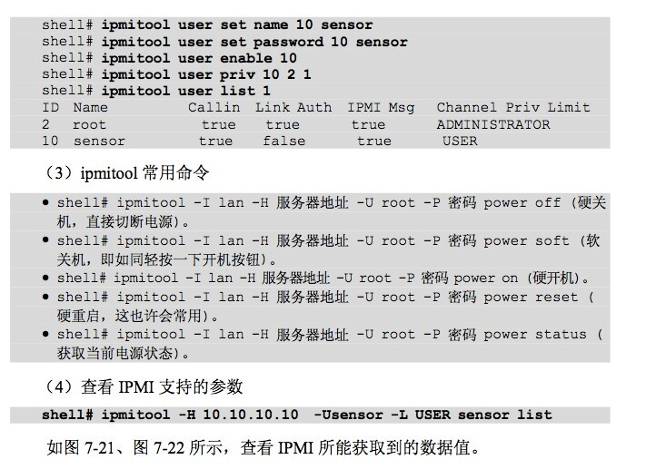

#参考资料：
http://www.gnu.org/software/freeipmi/
http://netkiller.github.io/monitoring/ipmitool.html
http://www.chenshake.com/summary-of-ipmi/
http://www.openfusion.net/linux/ipmi_on_centos
http://www.ibm.com/developerworks/cn/linux/l-ipmi/

#序言
	查看主板信息：dmidecode | more

	智能平台管理界面（IPMI，Intelligent Platform Management Interface）是管理基于
	Intel结构的企业级系统中所使用的外围设备采用的一种工业标准，
	用户能够利用IPMI监控服务器的物理健康特征，如温度、电压、风扇工作状态、电源状态等。
	该标准由美国英特尔、惠普（Hewlett-Packard）、NEC、美国戴尔电脑和SuperMicro等公司定制。
	新的版本是 IPMI2.0（http://www.intel.com/design/servers/ipmi/）。
##1、服务器硬件本身提供对 ipmi 的支持
	目前惠普、戴尔和 NEC 等大多数厂商的服务器都支持 IPMI 2.0，
	但并不是所有服务器都支持，所以应该先通过产品手册或在 BIOS 中确定服务器是否支持 ipmi，
	也就是说服务器在主板上要具有 BMC 等嵌入式的管理微控制器。
##2、操作系统提供相应的 ipmi 驱动
	通过操作系统监控服务器自身的 ipmi 信息时需要系统内核提供相应的支持，
	linux 系统通过内核对 OpenIPMI（ipmi 驱动）的支持来提供对 ipmi 的系统接口。
	在使用驱动之前，请先启动该驱动：

	service ipmi start
	或者启动模块：
	modprobe ipmi_msghandler
	modprobe ipmi_devintf
	modprobe ipmi_si
	modprobe ipmi_poweroff
	modprobe ipmi_watchdog
##3、ipmi 管理工具
	我们的集群选择的是 Linux 下的命令行方式的 ipmi 平台管理工具 ipmitool。“http://ipmitool.sourceforge.net/”
	ipmitool 命令需要通过相应的interface来访问BMC，在本地获取信息时候采用的是-I open，
	即为OpenIPMI接口，IPMItool命令包含的接口有open、lan、lanplus。
	其中open是指的是OpenIPMI与 BMC通信，Lan是通过Ethernet LAN网用IPV4的udp协议与BMC通信。
	UDP的数据段包含了IPMI request/resoponse消息，消息具有一个IPMI session 头和RMCP 头。

	IPMI使用Remote Management Control Protocol (RMCP) 版本1支持操作系统关闭（pre-OS和OS-absent），RMCP把把数据发送到UDP的623端口。
	象lan接口一样，lanplus同样使用 Ethernet LAN 的UDP协议与BMC通信，但是lanplus使用RMCP＋协议（在IPMIV20中描述）来同新，RMCP+允许使用改经的认证方式和数据完整性检查。
	Open端口用于本地监控系统使用的；Lan/lanplus通过网络进行远程监控。

##4、ipmitool本地监控使用命令
	ipmitool -I open command，其中-I open表示使用OpenIPMI接口，command有以下项：
	a)   raw：发送一个原始的IPMI请求，并且打印回复信息。
	b)   lan：配置网络（lan）信道(channel)
	c)   chassis ：查看底盘的状态和配置电源
	d)   event：向BMC发送一个已定义的事件（event），可用于测试配置的SNMP是否成功
	e)   mc：  查看MC（Management Contollor）状态和各种允许的项
	f)   sdr：打印传感器仓库中的任何监控项和从传感器读取到的值。
	g)   sensor：打印周详的传感器信息。
	h)   Fru：打印内建的Field Replaceable Unit (FRU)信息
	i)   sel： 打印 System Event Log (SEL)      
	j)   pef： 配置 Platform Event Filtering (PEF)，事件过滤平台用于在监控系统发现有event时候，用PEF中的策略进行事件过滤，然后看是否需要报警。
	k)   sol/isol：用于配置通过串口的Lan进行监控
	l)   user：配置BMC中用户的信息 。
	m)   channel：配置Management Controller信道。

	#命令能够获取传感器中的各种监测值和该值的监测阈值，包括（CPU温度，电压，风扇转速，电源调制模块温度，电源电压等信息）
	ipmitool -I open sensor list 
	
	#配置ID值等于id的监测项的各种限制值。	
	ipmitool -I open sensor thresh 
	
	#查看主板状态，其中包括了主板电源信息，主板工作状态等
	ipmitool -I open chassis status  
	
	#查看上次系统重启的原因
	ipmitool -I open chassis restart_cause 

	#查看支持的底盘电源相关策略。
	ipmitool -I open chassis policy list 
	
	#启动底盘，用此命令能够远程开机
	ipmitool -I open chassis power on 
	
	#关闭底盘，用此命令能够远程关机
	ipmitool -I open chassis power off 
	
	#实现硬重启，用此命令能够远程重启
	ipmitool -I open chassis power reset
	
	#使BMC重新硬启动 
	ipmitool -I open mc reset 	
	
	#查看BMC硬件信息
	ipmitool -I open mc info 
	
	#配置bmc相应的允许/禁止选项
	ipmitool -I open mc setenables =[on|off]
	
	#列出BMC任何允许的选项
	ipmitool -I open mc getenables 
	
	#打印现咱channel 1的信息
	ipmitool -I open lan print 1 

##5、远程获取服务器监控信息
	远程获取服务器监控信息时，需要系统硬件支持ipmiV1.5和IPMIV2.0。
	获取信息时，不需要在服务器上安装其他软件，只需要在监控的客户端上安装ipmi工具软件――ipmitool，
	并需要在相应命令中加入远端服务器的名字或者地址。Ipmitool可以通过LAN远程监控系统，
	同时BMC中保存有一序列用户名和密码，通过LAN进行远端访问需要用户名和密码。
	远程获取服务器监控信息时，需要加上远程服务器的地址。使用以下的命令格式：

	ipmitool -H 169.254.0.2 -U root -P 123456 -I lan command。 
	-H表示后面跟的是服务器的地址
	-U表示后面跟着用户名
	-P表示后面跟着用户密码
	command和本地获取信息相同

##6、设置本地BMC的IP和用户名密码 
	ipmitool -I open lan print 1                             显示BMC通道的信息，如果不知道BMC使用的是哪个通道，请使用下面的命令确认：
	ipmitool -I open channel info 1							 显示信道信息
	ipmitool -I open lan set 1 ipsrc static                  设置本地BMC地址为静态，才能设置IP
	ipmitool -I open lan set 1 ipaddr 192.168.70.233         设置本地BMC的IP地址
	ipmitool -I open lan set 1 netmask 255.255.255.0         子网掩码，别忘了设
	ipmitool -I open lan set 1 defgw ipaddr 192.168.70.254   网关，可设可不设，不过一定要确保监控它的机器位于同一路由

	ipmitool user list 1     查看BMC的用户列表
	ipmitool user set name 1 username 对BMC的1号用户设置用户名username
	ipmitool user set password 1 123456 对BMC的1号用户设置密码123456

#一、开源的实现
##openipmi
##ipmitool

#二、使用ipmitool 进行测试
	dntcloud-mgr01:~ # ipmitool user list 1
	Could not open device at /dev/ipmi0 or /dev/ipmi/0 or /dev/ipmidev/0: No such file or directory
	Get User Access command failed (channel 1, user 1)
	dntcloud-mgr01:~ # 

#三、需要添加如下内核模块
	[root@server~]# modprobe ipmi_watchdog
	[root@server~]# modprobe ipmi_poweroff
	[root@server~]# modprobe ipmi_devintf
	[root@server~]# modprobe ipmi_si
	[root@server~]# modprobe ipmi_msghandler
	modprobe ipmi_watchdog ipmi_poweroff ipmi_devintf ipmi_si ipmi_msghandler

	添加后可以：
	dntcloud-mgr01:~ # ipmitool user list 1
	ID  Name	     Callin  Link Auth	IPMI Msg   Channel Priv Limit
	2   root             true    true       true       ADMINISTRATOR
	dntcloud-mgr01:~ # 

#四、测试
##查看电源状态
	dntcloud-mgr01:~ # ipmitool -I lan -H 192.168.70.77 -U root -P 123456 chassis power status
	Error: Unable to establish LAN session
	Unable to get Chassis Power Status
	dntcloud-mgr01:~ # 

##虚拟机(192.168.70.166)测试
	heidsoft:~ # modprobe ipmi_si
	FATAL: Error inserting ipmi_si (/lib/modules/3.0.13-0.27-default/kernel/drivers/char/ipmi/ipmi_si.ko): No such device
	heidsoft:~ # 

#五、在物理机(192.168.70.77)上测试
##1、ipmitool设置Ip为动态
	dntcloud-mgr01:~ # ipmitool lan set 1 ipsrc dhcp
	dntcloud-mgr01:~ # ipmitool lan print 1
##2、ipmitool设置Ip为静态
	dntcloud-mgr01:~ # ipmitool lan set 1 ipsrc static
	dntcloud-mgr01:~ # ipmitool lan print 1
##3、ipmitool 设置用户密码
	ipmitool user set password 2 123456
##4、ipmitool 查看电源状态
	ipmitool -I lan -H 192.168.70.233 -U root -P 123456 chassis power status
	arp -s 192.168.70.233 00:1a:a0:21:f5:3c
##5、ipmitool 确定服务器的 LAN channel
	dntcloud-mgr01:~ # ipmitool -l open channel info 1
##6、ipmitool 配置通过和用户
	配置IPMI使用通道1
	ipmitool sol set enabled true 1
	配置IPMI使用用户2
	ipmitool sol payload enable 1 2
	
	在没执行这两条命令时报错如下：
	heidsoft:~ # ipmitool -I lanplus -H 192.168.70.233 -U root -P 123456 sol activate
	Error: Unable to establish IPMI v2 / RMCP+ session
	Error: No response activating SOL payload
	heidsoft:~ # ipmitool -I lan -H 192.168.70.233 -U root -P 123456 sol activate
	Error: This command is only available over the lanplus interface
	

	执行完这两条命令后，IPMI发送指令正常:

	
	
#命令附图
##图一

##图二
